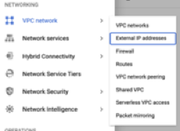
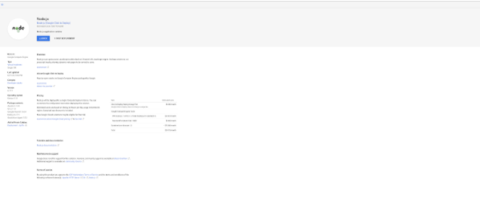
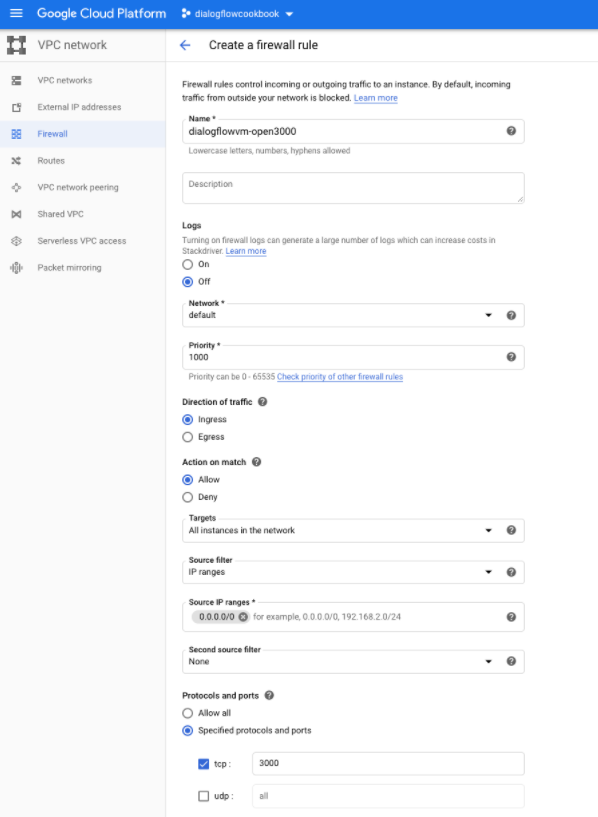
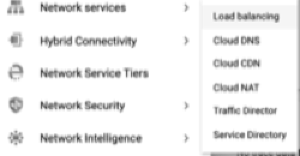
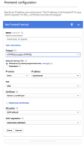
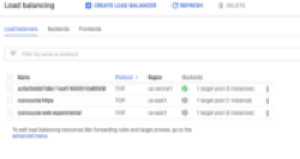
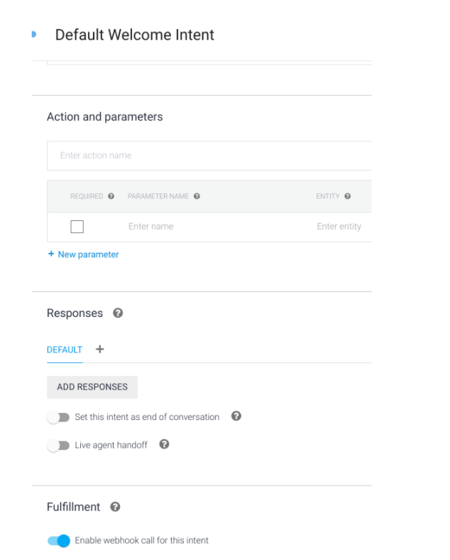
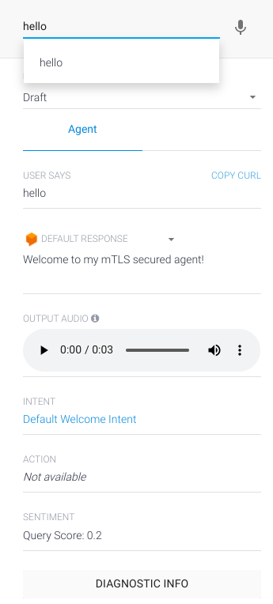

## **Mutual TLS authentication with Dialogflow**
Often a secure connection is needed to interact with some fulfillment logic that needs to be encrypted in flight. This guide attempts to show a sample implementation that addresses this need. The GCP products we will use in this sample implementation are [Load Balancer (LB)](https://cloud.google.com/load-balancing) as the front end with optional VM or Cloud Run as backend services. We want to utilize GCP's Load Balancer since it offers the most flexibility for certificate management. We also like the flexibility that comes with using a LB since it allows for us to switch or scale backend services without end user impact. For this example, we will use *nip.io* for our sample domain.   
  
### Allocate external IP
We first need to allocate an external IP for this secure communication. In this example, we will need to know the IP address to complete the domain registration for   
```<static_ip>.nip.io```  
navigate to *VPC Network -> External IP addresses* to create new static external IP address. for this example, we will use a standard tier IP address that is regional. If you are implementing a solution for production, it's recommended that you use the premier tier external IP.   
  
Please note the IP address once it has been reserved. We will use the IP address to formulate our domain in this example.   
  
    
### Create a VM

Create a Node JS VM with the following steps:

From the Cloud Console menu select:** Marketplace**

Choose **Node.js by Google Click to deploy image**
 





Select a region. Make sure HTTPS and  HTTPS is checked.

From the Cloud Console menu select:** VPC Network > Firewall > Create new firewall rule**

Targets**: All instances in network**

Source IP ranges**: 0.0.0.0/0**

Specified ports:** tcp > 3000**

Click** Create**



  

**Setup your Node application**


```
sudo mkdir /var/www/projects
sudo chown $USER /var/www/projects
cd /var/www/projects

nano index.js
```


Insert the code from the file “index.js”.


```
nano package.json
```


Insert the code from the file “package.json”. 

Install Node packages:


```
npm install
```


Start Node in the background:


```
node index.js &
```

Restart the Apache server:


```
sudo /etc/init.d/apache2 restart
```
  

### Create HTTPS load balancer and attach VM as backend
Navigate to *Network Services -> Load Balancing* to create your new Load Balancer (LB). For this example, we will create a HTTP(s) LB that uses the static [IP](#Allocate-external-IP)  address created previously.   

  

Give your LB a name, select the [VM](#Create-a-VM) created previously as *Backend Configuration*  

For front end configuration. make sure to change protocol to *HTTPS* and create a Google Manage certificate for domain (<external_ip>.nip.io) for your LB.   

  

once complete, you should see your newly created LB with a green check mark indicating that it's ready to take on traffic.   

  

  
### **Setup Dialogflow**

First, make sure that in Dialogflow, you are pointing to your new VM, from the **fulfillments** screen.


Second, make sure that in your “Default Welcome Intent” under _Responses_ is empty and _Fulfillment_ is enabled “Enable webhook call for this intent”.  We will call our Webhook to respond to the Welcome Intent.





Finally we can test in the “Try it now” section.  Say something like “hello” and see the response from the Node application: **_Welcome to my mTLS secured agent!_**





One final test.  Now that we specified to only allow requests from *.dialogflow.com, back in your browser, try to go directly to the domain and you should get an error message “ERR_BAD_SSL_CLIENT_AUTH_CERT”:


