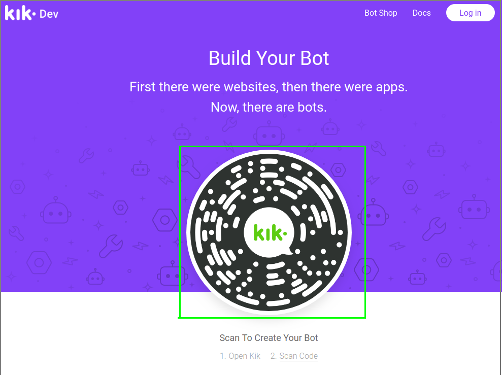
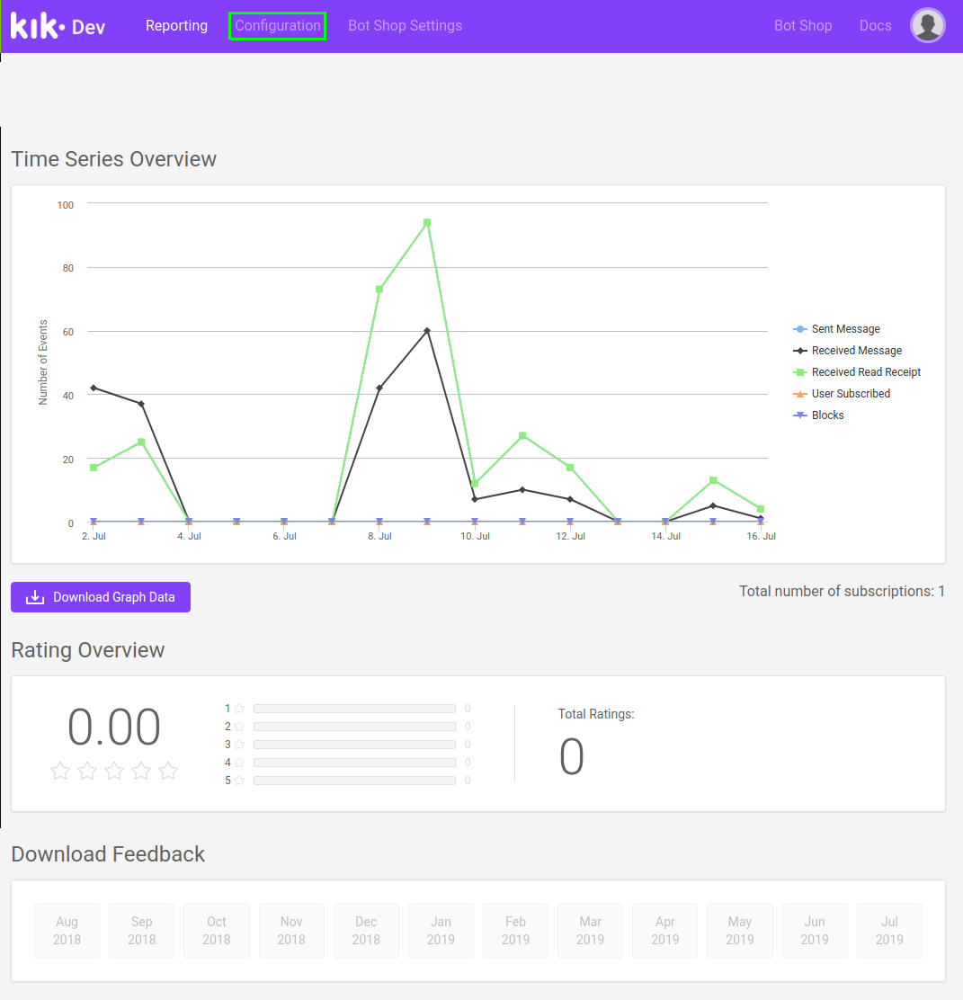
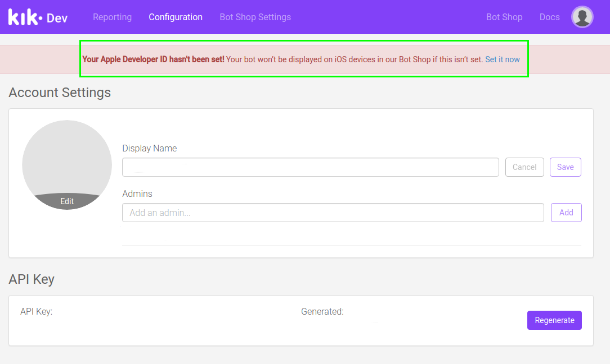
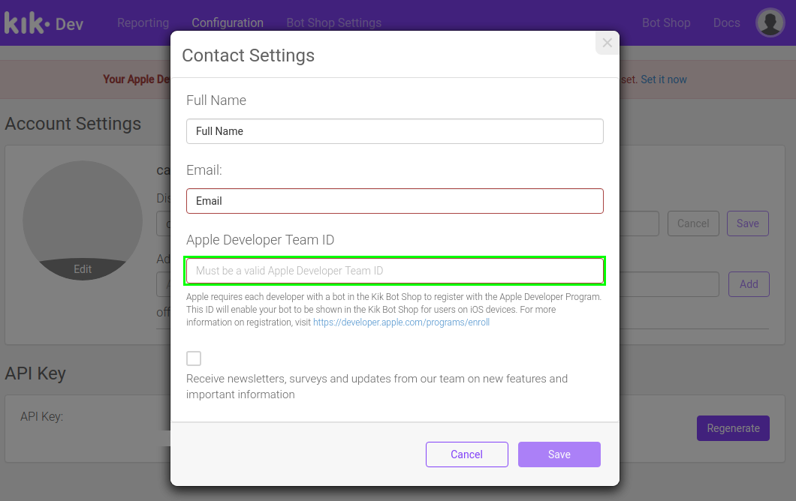

# Kik Integration

## Setup

### Prerequisites

- Follow the instructions on the main README file in the root directory of this repository.
- Download the Kik app onto your mobile device
- Set up your Kik account on that device
- Replace the value of __projectId__ in the [server.js file](https://github.com/GoogleCloudPlatform/dialogflow-integrations/blob/03676af04840c21c12e2590393d5542602591bee/kik/server.js#L33)  with your Dialogflow agent’s Project ID

### Creating the Bot

Open the Kik Bot Dashboard at [dev.kik.com](https://dev.kik.com). Open the Kik app on your mobile device. If using an iOS device, click the plus button in the top right corner. If using an Android device, tap the plus button in the bottom right corner. Tap "Scan a Kik Code" to scan the Kik code shown in the [Kik Bot Dashboard](https://dev.kik.com). 



In the Kik app, in the chat with Botsworth, enter a name for your bot and tap the "Yes" button to confirm.

### Obtain Kik Credentials

Login to the [Kik Bot Dashboard](https://dev.kik.com). At the top of the page, click "Configuration".



In the configuration screen, take the value for __Display Name__ and __API Key__ and replace the values for __botName__ and __kikApiKey__ in the [server.js file](https://github.com/GoogleCloudPlatform/dialogflow-integrations/blob/03676af04840c21c12e2590393d5542602591bee/kik/server.js#L30-L31) respectively.


### Deploy the Integration Using Cloud Run

In your local terminal, change the active directory to the repository’s root directory.

Run the following command to save the state of your repository into [GCP Container Registry](https://console.cloud.google.com/gcr/). Replace PROJECT-ID with your agent’s GCP Project ID and PLATFORM with the platform subdirectory name.

```shell
gcloud builds submit --tag gcr.io/PROJECT-ID/dialogflow-PLATFORM
```

Deploy your integration to live using the following command. Replace PROJECT-ID with your agent’s GCP project Id, PLATFORM with the platform subdirectory name, and YOUR_KEY_FILE with the name (not path) of your Service Account JSON key file.

```shell
gcloud beta run deploy --image gcr.io/PROJECT-ID/dialogflow-PLATFORM --update-env-vars GOOGLE_APPLICATION_CREDENTIALS=YOUR_KEY_FILE --memory 1Gi
```

- When prompted for a target platform, select a platform by entering the corresponding number (for example, ``1`` for ``Cloud Run (fully managed)``).
 - When prompted for a region, select a region (for example, ``us-central1``).
 - When prompted for a service name hit Enter to accept the default.
 - When prompted to allow unauthenticated invocations press ``y``.
 - Copy the URL given to you, and use it according to the README file in the
 given integration's folder.

Take the value for the server URL printed in the console after the completion of the execution of the above command and replace the value for __webhookUrl__ in the [server.js file](https://github.com/GoogleCloudPlatform/dialogflow-integrations/blob/03676af04840c21c12e2590393d5542602591bee/kik/server.js#L32). 

Redeploy the integration with the updated change by rerunning the above two commands. 

More information can be found in Cloud Run
[documentation](https://cloud.google.com/run/docs/deploying).

You can view a list of your active integration deployments under [Cloud Run](https://console.cloud.google.com/run) in the GCP Console.

## Additional Information

### iOS Bot Shop Information

Your bot will not be displayed in the Kik Bot Shop for iOS devices until your Apple Developer ID has been set. To see if your Apple Developer ID has been set, go to the [Kik Bot Dashboard](https://dev.kik.com) and go to the "Configuration" tab. A red banner near the top of the page will be present if your Apple Developer ID has not been set.



Click "Set it now" and insert your Apple Developer ID in the "Apple Developer Team ID" field.



### Sending Messages

- Messages can be batched in groups of up to 25.
- Bots are allowed up to 5 messages per user per batch. This limit is applied atomically to an entire batch of messages.

If a batch exceeds the 25 message limit or you attempt to send more than 5 messages to a single user in any batch, all messages in that batch will not be sent. If you attempt to send messages to users that are not subscribed or have blocked to your bot, the entire offending batch will not be sent.

### Additional References

For more information on building a Kik bot, go to:
- [Kik API Reference](https://dev.kik.com/#/docs/messaging)
- [Kik GitHub Repo](https://github.com/kikinteractive/kik-node)
