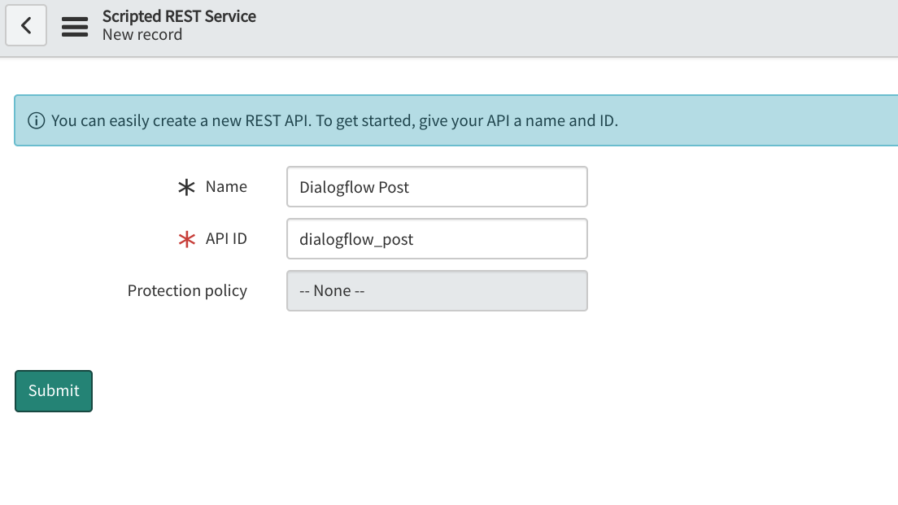
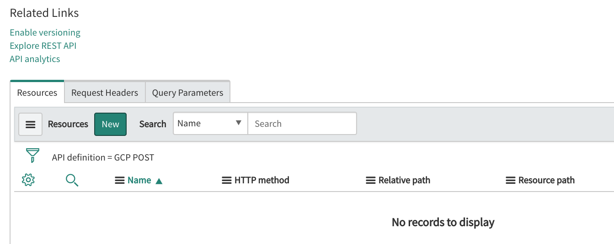
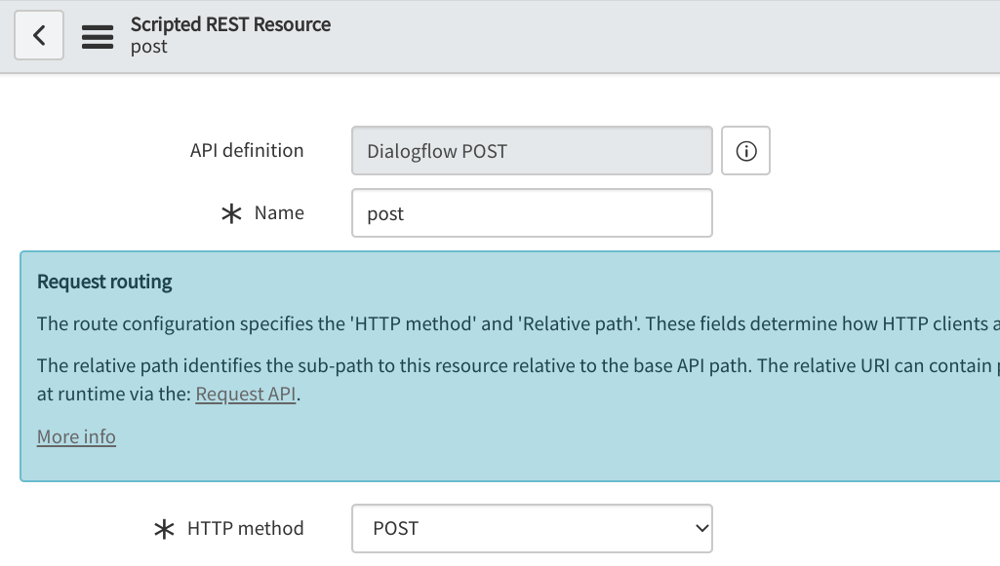
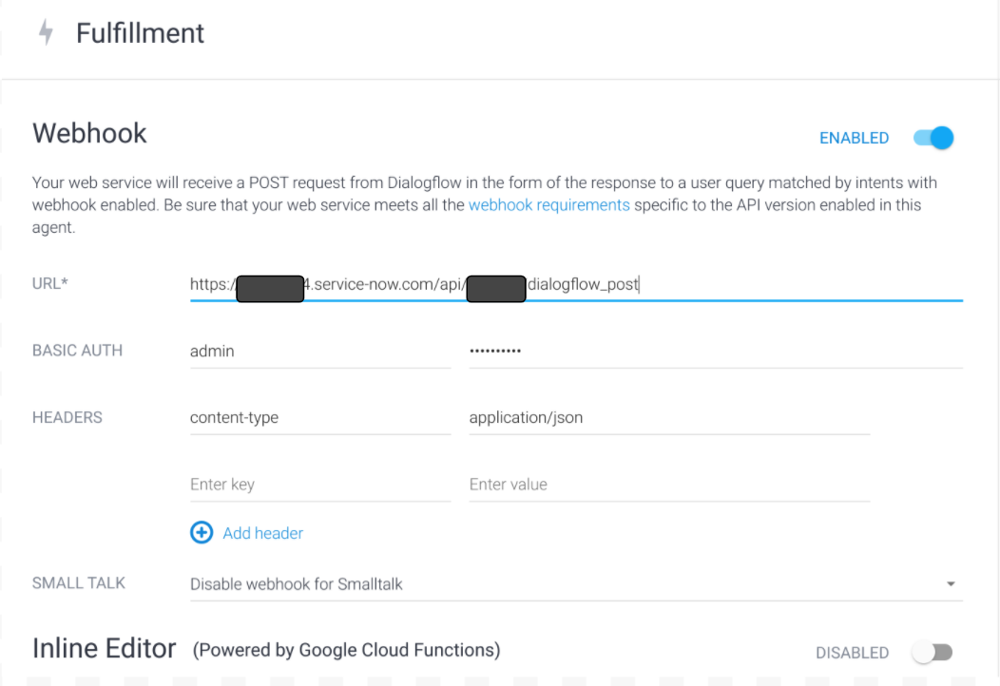
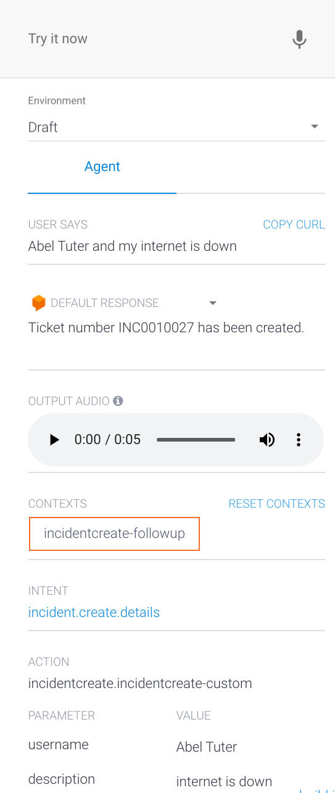
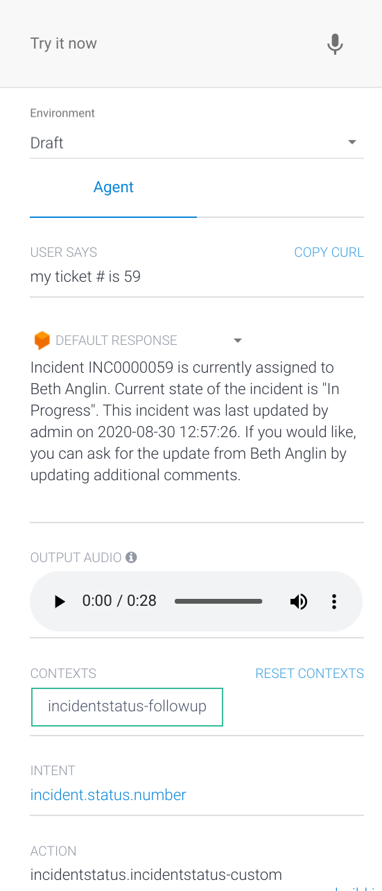

# **ServiceNow Integration**

## 
**Setup**

### 
**Prerequisites**

*   Follow the instructions on the [main README file](https://github.com/GoogleCloudPlatform/dialogflow-integrations#readme) in the root directory of this repository.
*   Create a [ServiceNow Developer account](https://developer.servicenow.com/dev.do).
*   Create a [Dialogflow Agent](https://dialogflow.cloud.google.com/).

### 
**Configuring ServiceNow**

*   Log into your ServiceNow Developer account.  If this is the first time you are logging in, you will need to create an _Instance_.  Follow the instructions on creating an Instance and select a _Release_.  As of this writing, Paris is the latest Release and it is recommended that you choose one of the latest releases, Orlando or Paris for this integration.
*   Click on your Instance URL (ex. _https://dev10101.service-now.com/_) and log in.  You will now be logged into the admin console.
*   From the Navigation menu, search for “Scripted REST APIs” and select this option.
*   From the Scripted REST APIs menu, click on the “New” button.
*   Provide a descriptive name like “Dialogflow Post”.  The API ID field will be automatically populated after you provide a name.  Click on the “Submit” button.

*   You will be returned to the “Scripted REST APIs” menu.  From the list of Services, find and select the one you just created.
*   **_Make a note of the “Base API path” as you will use this value to make your Dialogflow Webhook._**

*   Scroll down the page and on the Resources tab, click on the “New” button.

    

*   On the “Scripted REST Resource” page, provide a descriptive Name and in the “HTTP method” field, select “POST”.

 

*   In the “Script” section, replace the code with the code in the file “servicenow-script.txt” and then click the “Submit” button at the top.

### 
**Configuring Dialogflow**

*   In the [Dialogflow Console](https://dialogflow.cloud.google.com/), click on "Intents" and then click on the “Create Intent” button.  We will create the first intent to create an incident/ticket in ServiceNow.
*   Name the first Intent “incident.create” to match the name used in the ServiceNow script.
*   Provide a few “Training phrases” that you would like to trigger the Intent detection of this Intent like: _“I need to open a ticket”, “create an incident”, “Helpdesk Support”, etc._
*   In the “Responses” section, provide a Default Response _“Please provide your user name and short description of the issue.”_ and click the “Save” button.
*   From the Navigation menu, click on “Intents” and hover your mouse over the Intent you just created and select “Add follow-up intent”->”custom”.
*   Click on the new follow-up Intent and edit the Intent name to “incident.create.details”.
*   Provide a few “Training Phrases” to trigger the Intent detection of this Intent: _“David Miller and need to reset my password”, “Abel Tuter, my laptop has a black screen”, “Bud Richardson and my mobile phone will not turn on”_.  **_Note: The user name you provide here must match a name in the ServiceNow Users table.  From the ServiceNow Navigation menu, search for “Users” under Organization for a list of all users.  Sample data comes pre-loaded with new developer instances._**
*   The user name in the “Training Phrases” should have been detected as an Entity of type @sys.person, or @sys.given-name, or combination of.  Typically @sys.person is the recommended Entity type for a person’s name (first and last name).  However, when passing this parameter as a Rest request, an additional key value of “name:” gets passed along with the variable which doesn’t work with the ServiceNow function code.  
*   For this example, we will change each occurrence of the user name to an Entity of @sys.any and give it a parameter name of “username” and value “$username”.  To edit, click on the user name in the “Training Phrases”, select to delete any default Entity types, highlight the full user name, and change to @sys.any type.  For the short description of the user’s issue, highlight the issue statement and select Entity of @sys.any and provide a parameter name of “description” and value “$description”.  Your “Training Phrases” and “Action and parameters” sections should appear as followed:

*   Scroll down the page and leave the “Responses” section blank.  Expand the “Fulfillment” section and switch the toggle button to enable both options as follows:

*   Click the “Save” button at the top.  
*   We have just created the Intent to create a new incident/ticket in ServiceNow.  We will now create the second intent that checks on the status of an incident/ticket in ServiceNow.
*   From the Navigation menu, click on “Intents” and click on the “Create Intent” button.
*   Name the second Intent “incident.status” to match the name used in the ServiceNow script.
*   Provide a few “Training phrases” that you would like to trigger the Intent detection of this Intent like: _“what is the status of my ticket”, “I would like status on my incident”, “check on status of my ticket”, etc._
*   In the “Responses” section, provide a Default Response _“Okay, please provide your ticket number.”_ and click the “Save” button.
*   From the Navigation menu, click on “Intents” and hover your mouse over the Intent you just created and select “Add follow-up intent”->”custom”.
*   Click on the new follow-up Intent and edit the Intent name to “incident.status.number”.
*   Provide a few “Training Phrases” to trigger the Intent detection of this Intent: _“my ticket number is 30”, “the ticket number is INC0010060”, “my ticket # is 59”_.  **_Note: The ticket number that you provide here must match a number in the ServiceNow Incident table.  From the Navigation menu, search for “Incident” and click on “Open” for a list of all open tickets.  _**
*   The actual number in the “Training Phrases” should have been detected as an Entity of type @sys.number.   Ensure to highlight the full number and select Entity of @sys.number and provide a parameter name of “number” and value “$number”.  Your “Training Phrases” and “Action and parameters” sections should appear as followed:

*   Scroll down the page and leave the “Responses” section blank.  Expand the “Fulfillment” section and switch the toggle button to enable both options as follows:

*   Click the “Save” button at the top.  We have just created the Intent to get the status of an incident/ticket in ServiceNow.  
*   Now we need to configure our Webhook.
*   From the Dialogflow Navigation menu, click on “Fulfillment”.
*   Switch the toggle to enable the Webhook.
*   For “URL”, enter your ServiceNow Developer Instance URL along with the “Base API Path” to the ServiceNow Scripted REST Service that you created in an earlier step.
*   For “Basic Auth”, enter the login and password.  **_Note_**: _In this example we use the Admin credentials for simplicity, but for more than a Sandbox, you would want to create a new user to make the web requests or better, configure OAuth tokens._
*   For “Headers”, enter a key of “content-type” with a value of “application/json”.  Your Webhook should look similar to this:

*   Scroll down and click on the “Save” button.

### 
**Testing the Integration**

*   You have now completed all the necessary steps and can test your integration in the “Try it now” window.
*   Try creating a ticket:

*   Try checking on the status of a ticket:

### 

*   From the ServiceNow console Navigation menu, search for “incident” and click on “Open” for a list of all open tickets.  Find the ticket you just created:

