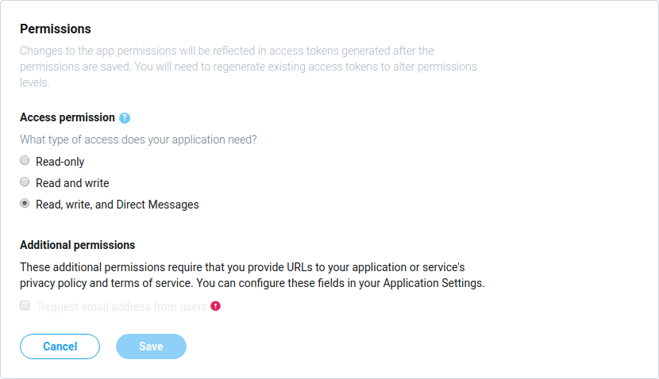
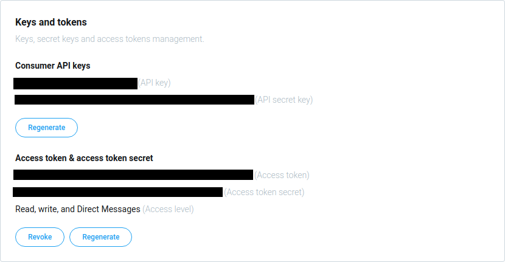
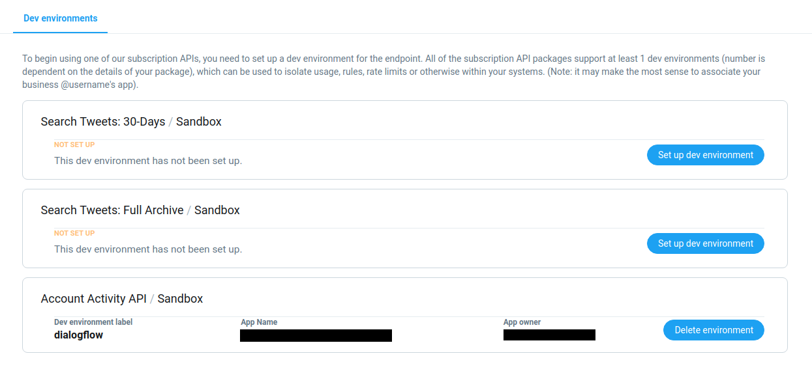

# Twitter Integration

## Setup

### Prerequisites

In order, to setup this integration, you must do the following first:
- Create a
[Developer Twitter account](http://developer.twitter.com/en/apply/user)
- Clone the [git repo](https://OUR_GIT_REPO)

### Create an App in Twitter

Login to your developer Twitter account and proceed to the
[Twitter App Management Console](https://developer.twitter.com/en/apps). Click
on the Create New App button. Fill out the required fields, and click Create.

### Obtain Twitter Credentials

Go back to the
[Twitter App Management Console](https://developer.twitter.com/en/apps), and
click the Details button on the project that you just created. Proceed to the
 Permissions tab and hit the Edit button. Set Access permission to Read, write
 and Direct Messages.

Next, go to the Keys and tokens tab. There, you should see your API keys and
access tokens. Copy these values and add them to there respective constants at
the top of server.js.

### Creating a Dev Environment

Log into your Twitter developer account and go to the
[Dev environments page](https://developer.twitter.com/en/account/environments).
In the Account Activity API section, click the Set up dev environment button.
Once you have created the environment, set the constant environmentName to the
name of the newly created environment.

### Setting the URL

Set the constant targetUrl in server.js to your server's URL that you will use
for your webhook. If you are using Google's Cloud Run to obtain your URL, deploy
your server according to the instructions in the main README file first. This
should give you your URL. Then, update your container and redeploy after you
have added the URL to server.js.

## Potentials Issues

###Duplicate Tweets

Twitter will block any duplicate tweets. So your Twitter bot may be prevented
from retweeting a person if they are triggering the same response multiple
times.

###Cloud Run 504 Error

Cloud Run will return 504 erros after the twitter receives a message. Do not be
concerned. These messages appear because of the way the Twitter integration
returns messages, not because there are any actual issues.

###Cloud Run Multiple Instances on Startup

Cloud Run will sometimes create multiple instances at startup due to a GET
request from Twitter during the startup process. This causes the startup to take
slightly longer, but there are no other issues this causes.